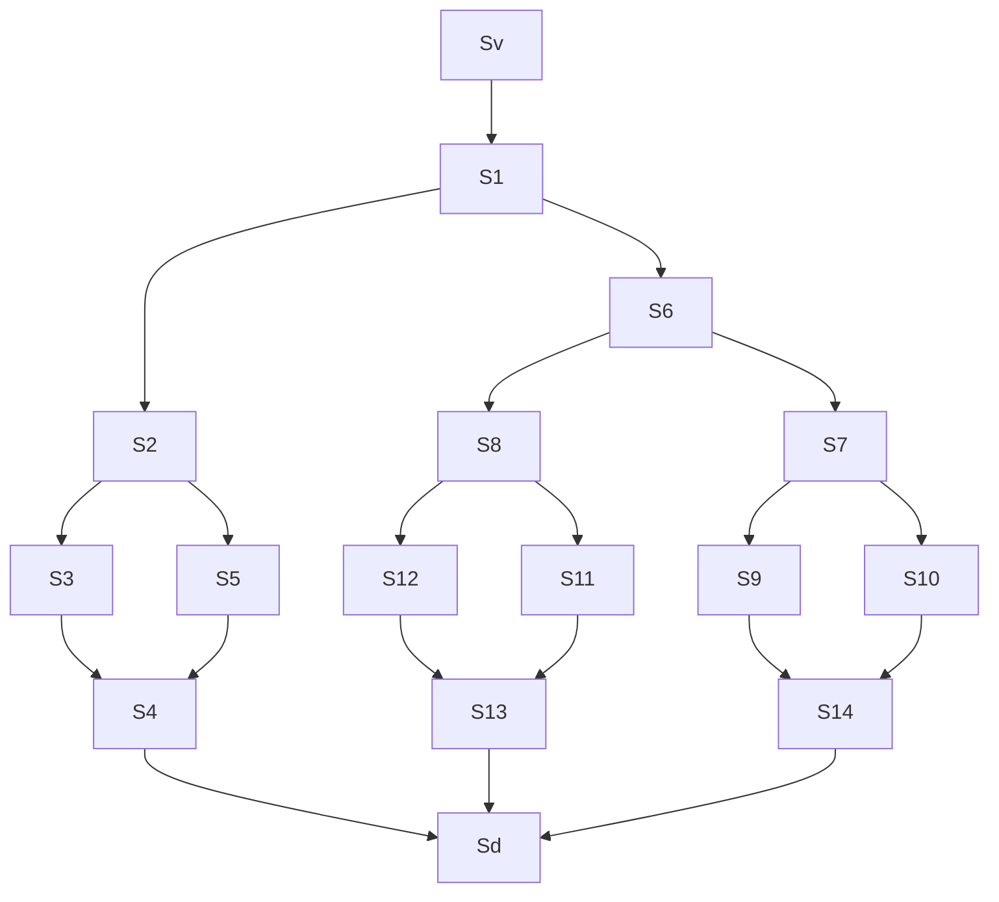
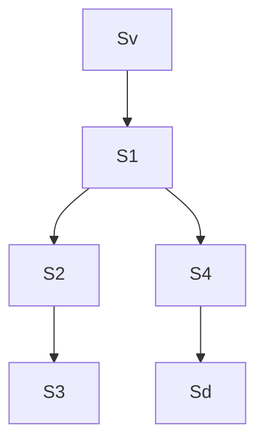

# uneviedefourmi
 

```mermaid
graph TD
    A[Sv] --> B[S1]
    B --> C[S2]
    C --> D[S3]
    D --> E[S4]
    E --> F[Sd]
    C --> G[S5]
    G --> E
    B --> H[S6]
    H --> I[S8]
    I --> J[S11]
    I --> P[S12]
    P --> K
    J --> K[S13]
    K --> F
    H --> L[S7]
    L --> M[S9]
    L --> N[S10]
    M --> O[S14]
    O --> F
    N --> O
```

```mermaid
graph TD
    A[Sv] --> B[S1]
    B --> C[S2]
    C --> D[S3]
    B --> E[S4]
    E --> F[Sd]
```