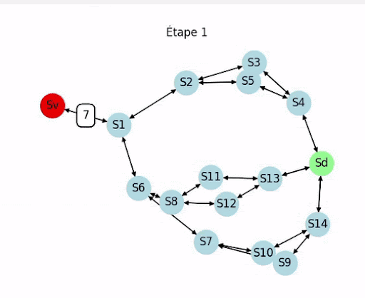

# uneviedefourmi
 
## 1. Introduction
Ce projet, que nous avons réalisé à quatre, avait pour but de nous familiariser avec les graphes ainsi que les matrices d'adjacence.  

## 2. Présentation du projet  
Pour cela, nous avions six fourmilières avec chacune un vestibule et un dortoir ainsi qu'un nombre de fourmis et de salles propre à chaque fourmilière.  Les salles de passages ont des capacités de fourmis différentes.  
Nous devions faire en sorte que toutes les fourmis partent du vestibule et arrivent au dortoir en respectant les capacités de salles et en ayant le moins d'étapes possible.  
Pour chacune des fourmilières nous devions:  
- Représenter la fourmilière sous forme de graphe.  
- Afficher l'ensemble des étapes nécessaires au déplacement des fourmis.  
- Représenter par un graphique le déplacement des fourmis au sein de la fourmilière, étape par étape.  

## 3. Représentation graphique des fourmilières.  

### Fourmilière 0

### Fourmilière 1

### Fourmilière 2

### Fourmilière 3

### Fourmilière 4

### Fourmilière 5

  

## 4. Fonctionalités.  

* Génération d'un graphe de salles et tunnels : Le programme lit une configuration de fourmilière à partir d'un fichier, construisant un graphe orienté avec une matrice d'adjacence pour représenter les connexions entre salles.
* Calcul des chemins optimaux : Utilise la bibliothèque NetworkX pour trouver tous les chemins possibles entre la salle de départ et la salle de dortoir. Les chemins sont triés pour prioriser les plus courts.
* Gestion des capacités de salles : Chaque salle peut avoir une capacité maximale de fourmis. Une fourmi ne peut pas entrer dans une salle pleine.
* Simulation des déplacements : Les fourmis se déplacent à travers le graphe en suivant les chemins assignés. Si un chemin devient inaccessible (ex. : salle pleine), le chemin est recalculé.
* Visualisation des déplacements : À chaque étape de la simulation, un graphe est dessiné pour montrer la position actuelle des fourmis.

## 5. Représentation graphique des déplacements.  

Pour réaliser la représentation graphique des déplacements des fourmis (dont vous pouvez voir l'animation) nous nous sommes servis des librairies Pyplot et NetworkX.  

## 6. Conclusion  
Nous avons décidé de faire le travail pour les six fourmilières du projet. Nous pouvons constater que la complexité des fourmilières ainsi que le nombre de fourmis influent fortement sur le nombre d'étapes nécessaires pour rapatrier tout le monde au dortoir.  
