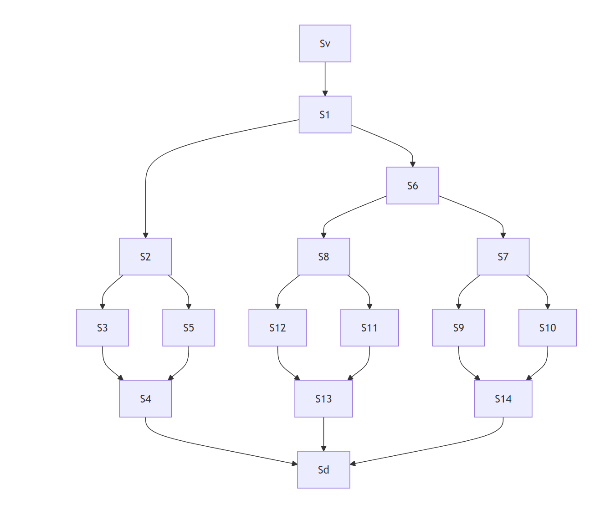

# uneviedefourmi
 
## 1. Introduction
Ce projet, que nous avons réalisé à quatre, avait pour but de nous familiariser avec les graphes ainsi que les matrices d'adjacence.  

## 2. Présentation du projet  
Pour cela, nous avions six fourmilières avec chacune un vestibule et un dortoir ainsi qu'un nombre de fourmis et de salles propre à chaque fourmilière.  Les salles de passages ont des capacités de fourmis différentes.  
Nous devions faire en sorte que toutes les fourmis partent du vestibule et arrivent au dortoir en respectant les capacités de salles et en ayant le moins d'étapes possible.  
Pour chacune des fourmilières nous devions:  
- Représenter la fourmilière sous forme de graphe.  
- Afficher l'ensemble des étapes nécessaires au déplacement des fourmis.  
- Représenter par un graphique le déplacement des fourmis au sein de la fourmilière, étape par étape.  

## 3. Représentation graphique des fourmilières.  

<u><i>Fourmilière 1.</i></u>
  

<u><i>Fourmilière 2.</i></u>
  

<u><i>Fourmilière 3.</i></u>
  

<u><i>Fourmilière 4.</i></u>
  

<u><i>Fourmilière 5.</i></u>
  

<u><i>Fourmilière 6.</i></u>
  

## 4. Affichage des étapes de déplacement pour les fourmis de chaque fourmilière.  
Afin de faire ceci, nous nous sommes servis de la librairie NetworkX  

## 5. Représentation graphique des déplacements.  

